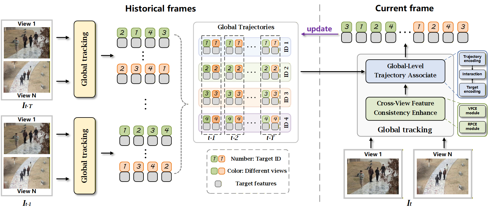

<table align="center" border="0" cellspacing="0" cellpadding="0">
  <tr>
    <td valign="middle">
      
    </td>
    <td>&nbsp;&nbsp;</td>
    <td valign="middle">
      <h1>
        GMT: Effective Global Framework for<br>
        Multi-Camera Multi-Target Tracking
      </h1>
    </td>
  </tr>
</table>

<p align="center">
  This repository is the official implementation of the <strong>CVPR 2026</strong> paper:
  <a href="https://arxiv.org/abs/2407.01007">GMT: Effective Global Framework for Multi-Camera Multi-Target Tracking</a>.
</p>


<p align="center">
  
</p>


## To-Do
* Release the VisionTrack dataset.
* Provide training tutorials for custom datasets.

## ⚙️ Install the environment
```
conda create -n GMT python=3.10
conda activate GMT
pip install torch==2.0.0 torchvision==0.15.1 torchaudio==2.0.1 --index-url https://download.pytorch.org/whl/cu118
pip install -r requirements.txt
```
After installing the base environment, install Detectron2 following [Detectron2 installation instructions](https://detectron2.readthedocs.io/en/latest/tutorials/install.html).

Then, replace the file `detectron2/evaluation/evaluator.py` in your Detectron2 installation with [evaluator.py](evaluator.py).

## ⚙️ Data Preparation
Put the tracking datasets in ./datasets. 

Run the [creat_json.py](creat_json.py) to generate annotation files for each dataset. The final data structure should look like this:
   ```
   ${PROJECT_ROOT}
    -- datasets
        -- VisionTrack
            |-- train
            |-- test
            |-- annotations
                |-- train_stage1.json
                |-- train.json
                |-- test.json
        -- DIVOTrack
            |-- train
            |-- test
            |-- annotations
        ...
   ```

VisionTrack dataset will be released soon.

## 🚀 Training
**Take VisionTrack as an example**

Stage1:

```
python train_net.py --config-file configs/VISION_stage1.yaml
```

Stage2:

Set the weight entry in the second-stage config file to the file path of first-stage weights.

```
python train_net.py --config-file configs/VISION_stage2.yaml
```

The original configuration files are provided in [configs](configs).

## 🚀 Testing

Modify the dataset information in `detectron2/evaluation/evaluator.py`.
```
python test_net.py --config-file configs/<DATASET_NAME>_test.yaml
```

## 📚 Evaluation
`./MOTChallengeEvalKit_cv_test` and `./TrackEval` function as evaluation tools, including ground truth files of datasets involved in the paper. Please refer to [DIVOTrack](https://github.com/shengyuhao/divotrack) for detailed operation instructions.


## 📣 Acknowledgments
* Thanks [GTR](https://github.com/xingyizhou/GTR) and [DIVOTrack](https://github.com/shengyuhao/divotrack) libraries for helping us to quickly implement our ideas!
* The code of GMT is licensed under the Apache 2.0 license.

## 📄 Citation
If you find GMT useful for your project or research, please 🌟 this repo and cite our work:
```
@inproceedings{GMT,
  title={GMT: Effective Global Framework for Multi-Camera Multi-Target Tracking},
  author={Zhen, Yihao and Xu, Mingyue and Wang, Qiang and Fan, Baojie and Dong, Jiahua and Zhao, Tinghui and Fan, Huijie},
  booktitle={The IEEE/CVF Conference on Computer Vision and Pattern Recognition 2026},
  year={2026}
}
```
